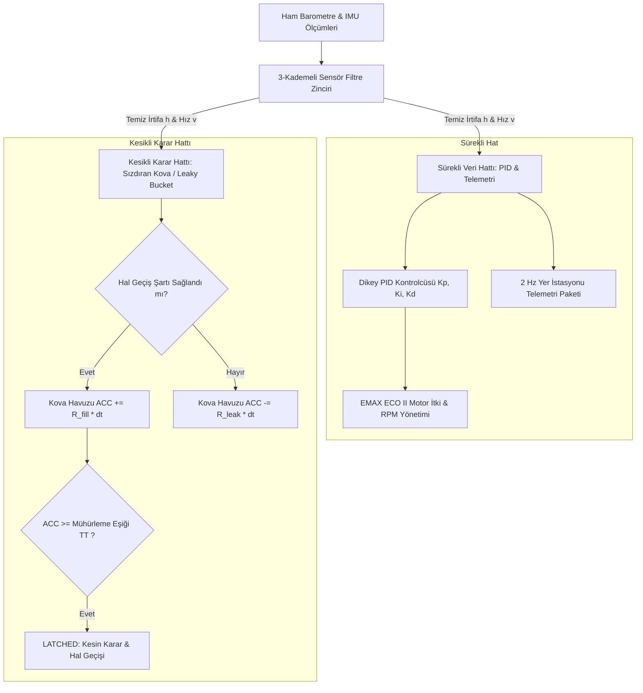

# TÜRKSAT MODEL UYDU YARIŞMASI 2026 - RASAT #801470
## UÇUŞ MİMARİSİ, ÇİFT HATLI VERİ İŞLEME VE MODÜLER ALT-SENARYO FİZİK MOTORU RAPORU

---

## 1. MİMARİ ÖZET VE ÇİFT HATLI (DUAL-PIPELINE) BORU HATTI

Model uydu yazılım ve benzetim mimarisinde **Sürekli Veri Akışı (PID & Telemetri)** ile **Kesikli Karar Akışı (Uçuş Hali Geçişleri / Leaky Bucket)** tamamen birbirinden ayrıştırılmış "Çift Hatlı" (Dual-Pipeline) bir mimariyle kurgulanmıştır.

---

## 2. TAM PARAMETRİK AYARLANABİLİR FİZİKSEL VE AERODİNAMİK DEĞİŞKENLER

Arayüz üzerinden simülasyon öncesinde kullanıcı tarafından değiştirilebilen tüm parametre grupları:

### A. Kütle ve Paraşüt Yüzey Genişliği Parametreleri
* **`MassCarrier` (Taşıyıcı Modül Kütlesi):** Varsayılan $0.55\text{ kg}$ (Ayrılma öncesi toplam kütleye $m_{\text{toplam}} = m_{\text{taşıyıcı}} + m_{\text{görev}}$ eklenir).
* **`MassPayload` (Görev Yükü Kütlesi):** Varsayılan $1.25\text{ kg}$.
* **`AreaCarrierParachute` (Taşıyıcı Ana Paraşüt Yüzey Genişliği):** Varsayılan $0.1256\text{ m}^2$ (Çapraz paraşüt referans alanı).
* **`AreaPayloadParachute` (Görev Yükü Yüzey Genişliği):** Varsayılan $0.0804\text{ m}^2$.
* **`AreaApamParachute` (APAM Acil Durum Paraşüt Yüzey Genişliği):** Varsayılan $0.5026\text{ m}^2$.
* **`AirDensity` (Hava Yoğunluğu $\rho$):** Varsayılan $1.10\text{ kg/m}^3$.

### B. Görev Süreleri ve İrtifa Eşik Parametreleri
* **`HoverDurationS4b` (S4b Asılı Kalma / Hover Süresi):** Varsayılan $10.0\text{ saniye}$ ($200\text{m}$ irtifada hedef hız $0\text{ m/s}$).
* **`HoverAltitudeS4b` (S4b Hover İrtifası):** Varsayılan $200.0\text{ m}$.
* **`SeparationAltitudeS3` (S3 Ayrılma Hedef İrtifası):** Varsayılan $400.0\text{ m}$.

---

## 3. MODÜLER ANA HAL VE ALT-SENARYO FİZİKSEL TABLOSU

| Ana Uçuş Hali | Alt-Senaryo Modeli (`FlightSubState`) | Aktif Kütle ($m$) | Paraşüt Alanı ($A$) | Sürtünme ($C_d$) | Teorik Limit Hız ($v_{\text{term}}$) | Kontrol Hedefi |
| :--- | :--- | :---: | :---: | :---: | :---: | :--- |
| **S1: YÜKSELME** | `S1_RocketAscent` | $1.80\text{ kg}$ | $0.02\text{ m}^2$ | $0.40$ | N/A | Tepe noktası ($1800\text{ m}$, $v_y \le 0$) |
| **S2: PASİF İNİŞ** | `S2_CruciformParachuteDescent` | $1.80\text{ kg}$ | $0.1256\text{ m}^2$ | $1.50$ | $-13.05\text{ m/s}$ | $400\text{ m}$ ayrılma irtifasına stabil iniş |
| **S3: AYRILMA** | `S3_PayloadSeparationShock` | $1.25\text{ kg}$ | $0.0804\text{ m}^2$ | $1.30$ | $-15.18\text{ m/s}$ | Görev yükü ayrılış şoku & stabilizasyon |
| **S4a: AKTİF İNİŞ** | `S4a_RapidApproachDescent` | $1.25\text{ kg}$ | $0.0804\text{ m}^2$ | $1.30$ | $-15.18\text{ m/s}$ | PID ile $-14\text{ m/s}$ hızında $200\text{m}$'ye yaklaşma |
| **S4b: AKTİF İNİŞ** | `S4b_BonusHover200m` | $1.25\text{ kg}$ | $0.0804\text{ m}^2$ | $1.30$ | N/A | **BONUS-1 HOVER:** $200\text{m}$'de parametrik süre boyunca $0\text{ m/s}$ asılı kalma |
| **S4c: AKTİF İNİŞ** | `S4c_SigmaControlledDescent` | $1.25\text{ kg}$ | $0.0804\text{ m}^2$ | $1.30$ | $-15.18\text{ m/s}$ | Son $50\text{m}$'de sabit $-4\text{ m/s}$ yumuşak iniş |
| **S5: YER BİLDİRİM**| `S5_TouchdownRecovery` | $1.25\text{ kg}$ | $0.0804\text{ m}^2$ | $1.30$ | $0.0\text{ m/s}$ | Motorlar kilitli (%0 RPM), kurtarma bayrağı |
| **APAM (ACİL)** | `APAM_EmergencyDeployment` | $1.25\text{ kg}$ | $0.5026\text{ m}^2$ | $1.60$ | $-5.30\text{ m/s}$ | Aşırı hızda acil durum paraşüt açılışı |

---

## 4. ETKİLEŞİMLİ ZAMAN OYNATICISI (TIMELINE PLAYER & SCRUBBER)

`FormSensorAnalizi` arayüzünün 2. Sekmesine entegre edilen **Zaman Oynatıcısı (Timeline Player)** sayesinde simülasyon sonuçları saniye saniye incelenebilir:
1. **▶ Oynat / ⏸ Durdur (`btnPlayPause`):** Simülasyonu zaman çizelgesi üzerinde akıcı şekilde oynatır veya durdurur.
2. **⏮ Geri Al / ⏭ İleri Al (`btnStepBack` / `btnStepFwd`):** Simülasyonu adım adım ileri/geri kaydırarak anlık değişimleri yakalar.
3. **Zaman Kaydırıcı (`TrackBar`):** İstenilen milisaniyeye/saniyeye anında atlanabilir.
4. **Canlı Dikey İmleç (Crosshair):** Oynatma anındaki zaman $t$, hem **İrtifa-Zaman** hem de **Sızdıran Kova Havuzu** grafiklerinde kırmızı dikey bir kesit çizgisi ile canlı işaretlenir.
5. **Modüler Telemetri Paneli:** Seçilen anlık zamandaki aktif kütle, aktif aerodinamik alan, limit hız, motor RPM, itki kuvveti ve kova doluluk oranı (`ACC / TT`) canlı gösterge panelinde eş zamanlı raporlanır.
