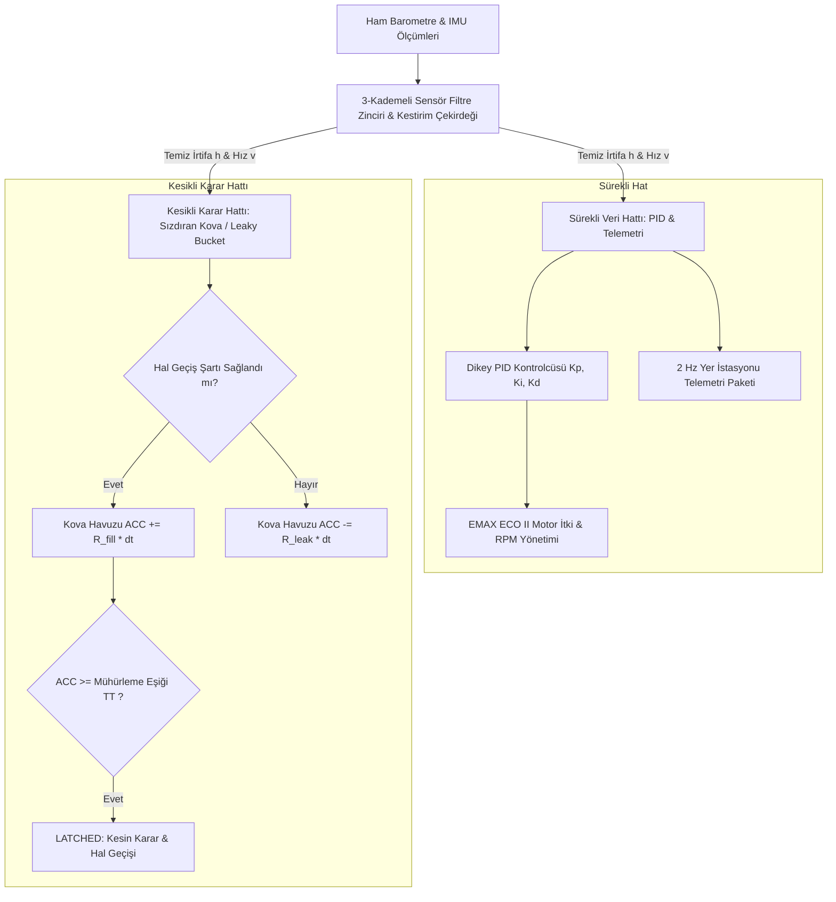
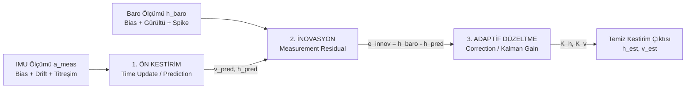
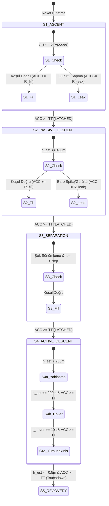

# TÜRKSAT MODEL UYDU YARIŞMASI 2026 - RASAT #801470
## UÇUŞ MİMARİSİ, ÇİFT HATLI VERİ İŞLEME, KESTİRİM ÇEKİRDEĞİ VE SIZDIRAN KOVA (LEAKY BUCKET) RAPORU

---

## 1. MİMARİ ÖZET VE ÇİFT HATLI (DUAL-PIPELINE) BORU HATTI

Model uydu yazılım ve benzetim mimarisinde **Sürekli Veri Akışı (PID & Telemetri)** ile **Kesikli Karar Akışı (Uçuş Hali Geçişleri / Leaky Bucket)** tamamen birbirinden ayrıştırılmış "Çift Hatlı" (Dual-Pipeline) bir mimariyle kurgulanmıştır.

---

## 2. TAM PARAMETRİK AYARLANABİLİR FİZİKSEL VE AERODİNAMİK DEĞİŞKENLER

Arayüz üzerinden simülasyon öncesinde kullanıcı tarafından değiştirilebilen tüm parametre grupları:

### A. Kütle ve Paraşüt Yüzey Genişliği Parametreleri
* **`MassCarrier` (Taşıyıcı Modül Kütlesi):** Varsayılan $0.55\text{ kg}$ (Ayrılma öncesi toplam kütleye $m_{\text{toplam}} = m_{\text{taşıyıcı}} + m_{\text{görev}}$ eklenir).
* **`MassPayload` (Görev Yükü Kütlesi):** Varsayılan $1.25\text{ kg}$.
* **`AreaCarrierParachute` (Taşıyıcı Ana Paraşüt Yüzey Genişliği):** Varsayılan $0.1256\text{ m}^2$ (Çapraz paraşüt referans alanı).
* **`AreaPayloadParachute` (Görev Yükü Yüzey Genişliği):** Varsayılan $0.0804\text{ m}^2$.
* **`AreaApamParachute` (APAM Acil Durum Paraşüt Yüzey Genişliği):** Varsayılan $0.5026\text{ m}^2$.
* **`AirDensity` (Hava Yoğunluğu $\rho$):** Varsayılan $1.10\text{ kg/m}^3$.

### B. Görev Süreleri ve İrtifa Eşik Parametreleri
* **`HoverDurationS4b` (S4b Asılı Kalma / Hover Süresi):** Varsayılan $10.0\text{ saniye}$ ($200\text{m}$ irtifada hedef hız $0\text{ m/s}$).
* **`HoverAltitudeS4b` (S4b Hover İrtifası):** Varsayılan $200.0\text{ m}$.
* **`SeparationAltitudeS3` (S3 Ayrılma Hedef İrtifası):** Varsayılan $400.0\text{ m}$.

---

## 3. MODÜLER ANA HAL VE ALT-SENARYO FİZİKSEL TABLOSU

| Ana Uçuş Hali | Alt-Senaryo Modeli (`FlightSubState`) | Aktif Kütle ($m$) | Paraşüt Alanı ($A$) | Sürtünme ($C_d$) | Teorik Limit Hız ($v_{\text{term}}$) | Kontrol Hedefi |
| :--- | :--- | :---: | :---: | :---: | :---: | :--- |
| **S1: YÜKSELME** | `S1_RocketAscent` | $1.80\text{ kg}$ | $0.02\text{ m}^2$ | $0.40$ | N/A | Tepe noktası ($1800\text{ m}$, $v_y \le 0$) |
| **S2: PASİF İNİŞ** | `S2_CruciformParachuteDescent` | $1.80\text{ kg}$ | $0.1256\text{ m}^2$ | $1.50$ | $-13.05\text{ m/s}$ | $400\text{ m}$ ayrılma irtifasına stabil iniş |
| **S3: AYRILMA** | `S3_PayloadSeparationShock` | $1.25\text{ kg}$ | $0.0804\text{ m}^2$ | $1.30$ | $-15.18\text{ m/s}$ | Görev yükü ayrılış şoku & stabilizasyon |
| **S4a: AKTİF İNİŞ** | `S4a_RapidApproachDescent` | $1.25\text{ kg}$ | $0.0804\text{ m}^2$ | $1.30$ | $-15.18\text{ m/s}$ | PID ile $-14\text{ m/s}$ hızında $200\text{m}$'ye yaklaşma |
| **S4b: AKTİF İNİŞ** | `S4b_BonusHover200m` | $1.25\text{ kg}$ | $0.0804\text{ m}^2$ | $1.30$ | N/A | **BONUS-1 HOVER:** $200\text{m}$'de parametrik süre boyunca $0\text{ m/s}$ asılı kalma |
| **S4c: AKTİF İNİŞ** | `S4c_SigmaControlledDescent` | $1.25\text{ kg}$ | $0.0804\text{ m}^2$ | $1.30$ | $-15.18\text{ m/s}$ | Son $50\text{m}$'de sabit $-4\text{ m/s}$ yumuşak iniş |
| **S5: YER BİLDİRİM**| `S5_TouchdownRecovery` | $1.25\text{ kg}$ | $0.0804\text{ m}^2$ | $1.30$ | $0.0\text{ m/s}$ | Motorlar kilitli (%0 RPM), kurtarma bayrağı |
| **APAM (ACİL)** | `APAM_EmergencyDeployment` | $1.25\text{ kg}$ | $0.5026\text{ m}^2$ | $1.60$ | $-5.30\text{ m/s}$ | Aşırı hızda acil durum paraşüt açılışı |

---

## 4. KESTİRİM ÇEKİRDEĞİ (ESTIMATION KERNEL / ADAPTİF EKF) ALGORİTMASI VE MATEMATİKSEL MODELİ

Uçuş sırasında **Barometre (BMP388/MS5611)** ve **İvmeölçer (MPU6050/BMI088/IMU)** tek başlarına kullanıldığında kritik fiziksel yetersizlikler gösterir:
* **Barometre Yetersizliği:** Rüzgar darbeleri (gust), roket ayrılma şoku veya gövde içi türbülans nedeniyle **statik basınç dalgalanmaları (Spike / Bias)** yaşar. Bu durum ani irtifa zıplamalarına sebep olur.
* **İvmeölçer Yetersizliği:** İvmeölçer yüksek frekanslı dinamik hareketleri harika yakalar ancak ham ivme çift katlı integrali alındığında ($h = \iint a \, dt^2$) en küçük bir **sıfır noktası kayması (Zero-G Bias)** bile zamanla parabolik olarak büyüyen sonsuz bir hataya (**Parabolic Drift**) yol açar. Ayrıca motor çalışırken (`EMAX ECO II`) gövdede **yüksek frekanslı motor titreşim gürültüsü (`ImuVibrationStd`)** oluşur.

Bu iki sensörün zayıf yönlerini sönümleyip güçlü yönlerini harmanlamak için **3 Kademeli Adaptif Genişletilmiş Kalman / Tamamlayıcı Filtre (EKF Kernel)** geliştirilmiştir.

### A. Sensör Hata Modelleri (Fizik Simülasyonu Girdileri)
Barometre ve IMU ölçümleri fizik motorunda şu denklemlerle üretilir:

$$\tilde{h}_{baro} = h_{true} \cdot \left(1 + \frac{S_{baro}}{100}\right) + B_{baro} + \eta_{thermal}^{(baro)} + \eta_{spike}^{(baro)}$$

$$\tilde{a}_{imu} = a_{true} \cdot \left(1 + \frac{S_{imu}}{100}\right) + B_{imu} + B_{shift} + \eta_{thermal}^{(imu)} + \eta_{spike}^{(imu)} + \eta_{vib}$$

* $S_{baro}, S_{imu}$: Bağıl ölçekleme hatası yüzdesi (`Scale Error %`).
* $B_{baro}, B_{imu}$: Mutlak statik sapma (`Bias` - metre veya $\text{m/s}^2$).
* $\eta_{thermal}$: Gauss dağılımlı termal beyaz gürültü ($\mathcal{N}(0, \sigma^2)$).
* $\eta_{spike}$: Belirli sıklıkta (`SpikeFreq %`) ortaya çıkan ani darbe gürültüsü (`Spike Std`).
* $\eta_{vib}$: Roket yükseliş (`S1`), ayrılma (`S3`) ve motorlu aktif iniş (`S4`) safhalarında aktive olan gövde/motor titreşim gürültüsü (`ImuVibrationStd`).

---

### B. Adım 1: İvmeölçer ile Ön Kestirim (Time Update / Prediction)
İvmeölçerden gelen net dikey ivme ($\tilde{a}_{vert} = \tilde{a}_{imu} - g$) kullanılarak sistemin bir sonraki adımdaki konumu ve hızı integrasyonla tahmin edilir:

$$\hat{v}_{pred} = \hat{v}_{k-1} + \tilde{a}_{vert} \cdot \Delta t$$

$$\hat{h}_{pred} = \hat{h}_{k-1} + \hat{v}_{k-1} \cdot \Delta t + \frac{1}{2} \tilde{a}_{vert} \cdot \Delta t^2$$

---

### C. Adım 2: İnovasyon (Measurement Residual)
Barometreden gelen gürültülü anlık ölçüm $\tilde{h}_{baro}$ ile ivmeölçerin ön kestirimi arasındaki fark (inovasyon) hesaplanır:

$$e_{innov} = \tilde{h}_{baro} - \hat{h}_{pred}$$

---

### D. Adım 3: Adaptif Kalman Kazancı ile Düzeltme (Correction)
İnovasyon değeri, sisteme tanımlanan **Kalman Konum Kazancı ($K_h$)** ve **Kalman Hız Kazancı ($K_v$)** ile çarpılarak ön kestirim düzeltilir:

$$\hat{h}_k = \hat{h}_{pred} + K_h \cdot e_{innov}$$

$$\hat{v}_k = \hat{v}_{pred} + K_v \cdot e_{innov}$$

* **Füzyonun Oransal Dengesi Neden Çalışır?**
  * $K_h = 0.18$ ve $K_v = 0.005$ katsayıları sayesinde barometrede bir darbe gürültüsü (Spike) yaşansa bile bunun ancak $\%18$'i konuma, $\%0.5$'i hıza etki eder.
  * İvmeölçerin zamanla oluşturduğu parabolik kayma (Drift) ise her periyotta barometrenin mutlak referansı ($e_{innov}$) ile sürekli traşlanır. Bu çift taraflı denge, her iki sensörün de bireysel hatalarının oransal olarak sönümlenmesini sağlar.

---

## 5. HER UÇUŞ SAFHASI İÇİN SIZDIRAN KOVA (LEAKY BUCKET) ALGORİTMASI VE HATALI TETİKLEME ÖNLEME MEKANİZMASI

Uçuş sırasında statik eşik kontrolleri (`if (altitude < 400.0) state = S3;`) **son derece tehlikelidir**. Örneğin barometrede rüzgar darbesinden dolayı anlık $+15\text{m}$ veya $-15\text{m}$ sıçrama yaşandığında basit bir `if` koşulu sistemi yanlışlıkla bir sonraki safhaya geçirir (Erken Paraşüt Patlatma / Erken Motor Açma).

Bunu kesin olarak engellemek için **Sızdıran Kova (Leaky Bucket / Birikimli Karar Havuzu)** algoritması geliştirilmiştir.

### A. Sızdıran Kova Temel Denklemi
Her uçuş safhasında kova havuzundaki birikim ($ACC_k$) şu matematiksel denkleme göre güncellenir:

$$ACC_k = \max\left(0, \quad ACC_{k-1} + \left[ R_{fill} \cdot \mathbb{I}(\text{Koşul}) - R_{leak} \cdot (1 - \mathbb{I}(\text{Koşul})) \right] \cdot \Delta t \right)$$

* $ACC_k$: Kova havuzundaki anlık birikim düzeyi (Varsayılan başlangıç: $0.0$).
* $R_{fill}$ (`BucketFillRate`): Hal geçiş koşulu sağlandığında kovaya saniyede eklenen dolum hızı (Varsayılan: $2.5\text{ birim/sn}$).
* $R_{leak}$ (`BucketLeakRate`): Koşul gürültü sebebiyle geçici olarak kaybolduğunda kovadan saniyede sızan boşalma hızı (Varsayılan: $1.2\text{ birim/sn}$).
* $\mathbb{I}(\text{Koşul})$: Belirtilen hal geçiş koşulu o an doğruysa $1$, yanlışsa $0$ değerini alan gösterge fonksiyonu.
* $TT$ (`BucketThreshold`): Kararın mühürlenmesi (**LATCHED**) için gereken üst eşik (Varsayılan: $4.0\text{ birim}$).

> [!IMPORTANT]
> **Karar Mühürleme (Latching):** $ACC_k \ge TT$ şartı sağlandığı anda kova taşar, durum **LATCHED** bayrağı alır ve araç resmi olarak bir sonraki uçuş safhasına geçer. Kova bir sonraki safha için $ACC = 0$ olarak sıfırlanır.

---

### B. Her Uçuş Safhası (`FlightState`) İçin Kova Dolum ve Boşalma Detayları

#### 1. S1: ROKET YÜKSELME ($\to$ S2 PASİF İNİŞ GEÇİŞİ)
* **Hedef Koşul ($\mathbb{I}$):** Uydunun tepe noktasına (`Apogee`) ulaşması. Dikey hızın aşağı yönlü dönmesi ($\hat{v}_z \le 0\text{ m/s}$) VEYA kestirim irtifasının bir önceki adımdan düşük olması.
* **Kova Dolum Davranışı:** Roket tırmanışı bitip tepe noktasına geldiğinde hız sıfırın altına iner ve kova $R_{fill} = 2.5$ hızıyla dolmaya başlar. $1.6\text{ saniye}$ boyunca kesintisiz düşüş doğrulandığında ($2.5 \times 1.6 = 4.0 \ge TT$), S2 Pasif İniş fazına geçilir.
* **Hatalı Tetikleme Engelleme:** Roket tırmanırken barometrede ani bir statik basınç şoku yaşanıp irtifa $1\text{ periyot}$ düşük okunsaydı, kova yalnızca $+0.125$ birim dolacak, hemen sonraki periyotta tırmanış devam ettiği için kova sızdırıp ($R_{leak}$) sıfırlanacaktır. Böylece roket tırmanırken ana paraşüt asla erken açılmaz.

---

#### 2. S2: PASİF İNİŞ ($\to$ S3 GÖREV YÜKÜ AYRILMASI GEÇİŞİ)
* **Hedef Koşul ($\mathbb{I}$):** Kestirim irtifasının hedef ayrılma irtifasına veya altına inmesi ($\hat{h}_{est} \le SeparationAltitude_{S3}$, Örn: $400\text{ m}$).
* **Kova Dolum Davranışı:** Uydu $400\text{m}$ sınırına girdiğinde kova dolmaya başlar. $1.6\text{ saniye}$ boyunca irtifanın gerçekten $400\text{m}$ altında olduğu teyit edildiğinde mühürleme gerçekleşir ve taşıyıcı modül ile görev yükü ayrılır (`S3`).
* **Hatalı Tetikleme Engelleme:** Uydu henüz $420\text{m}$ irtifadayken şiddetli bir rüzgar darbesi barometrede $-25\text{m}$'lik bir sahte düşüş gösterse (ölçüm $395\text{m}$ olsa bile), kova dolmaya başlar. Ancak $0.2\text{ saniye}$ sonra darbe geçip barometre tekrar $410\text{m}$ okuduğunda kova dolumu durur ve içindeki küçük birikim sızarak ($R_{leak}$) sıfırlanır. **Sonuç:** Görev yükü asla havada erken ayrılmaz!

---

#### 3. S3: AYRILMA ŞOKU ($\to$ S4a AKTİF İNİŞ YAKLAŞMA GEÇİŞİ)
* **Hedef Koşul ($\mathbb{I}$):** Ayrılma sonrası mekanik şokun ve paraşüt açılma türbülansının sönümlenmesi (Ayrılmadan itibaren en az $2.0\text{ saniye}$ geçmesi veya dikey ivmenin stabil hale gelmesi).
* **Kova Dolum Davranışı:** Ayrılma patlamasının ardından IMU üzerindeki şiddetli salınımlar durulduğunda kova dolar ve S4a Aktif İniş fazına geçilerek motor kontrolcüsü (`PID`) devreye alınır.

---

#### 4. S4a: AKTİF YAKLAŞMA ($\to$ S4b BONUS HOVER ASILI KALMA GEÇİŞİ)
* **Hedef Koşul ($\mathbb{I}$):** Kestirim irtifasının asılı kalma (hover) irtifasına ulaşması ($\hat{h}_{est} \le HoverAltitude_{S4b}$, Örn: $200\text{ m}$).
* **Kova Dolum Davranışı:** Uydu $-14\text{ m/s}$ hızla $200\text{m}$ sınırına girdiğinde kova dolar. $TT = 4.0$ eşiği aşıldığında sistem S4b Hover moduna kilitlenir ve PID hedef hızı anında $0\text{ m/s}$ (asılı kalma) olarak güncellenir.

---

#### 5. S4b: BONUS HOVER ASILI KALMA ($\to$ S4c SABİT YUMUŞAK İNİŞ GEÇİŞİ)
* **Hedef Koşul ($\mathbb{I}$):** $200\text{m}$ irtifada geçirilen sürenin hedef hover süresini tamamlaması ($t_{hover} \ge HoverDuration_{S4b}$, Örn: $10.0\text{ saniye}$).
* **Kova Dolum Davranışı:** $10.0\text{ saniye}$ boyunca uydunun $0\text{ m/s}$ hızla asılı kaldığı süre sayacı dolduğunda kova tetiklenir ve araç S4c alçak irtifa yumuşak iniş moduna ($v_{hedef} = -4\text{ m/s}$) geçer.

---

#### 6. S4c: SABİT YUMUŞAK İNİŞ ($\to$ S5 YER KURTARMA GEÇİŞİ)
* **Hedef Koşul ($\mathbb{I}$):** Yere temas (`Touchdown`) doğrulaması. Kestirim irtifasının $\hat{h}_{est} \le 0.5\text{ m}$ VE dikey hızın mutlak değerce $|\hat{v}_z| \le 0.5\text{ m/s}$ olması.
* **Kova Dolum Davranışı:** Uydu ayakları yere oturduğunda ivmeölçer net $0\text{ g}$ hareketsizlik algılar ve barometre sıfır noktasında sabitlenir. Kova $1.6\text{ saniye}$ içinde dolarak **S5 Yer Kurtarma Moduna** kilitlenir.
* **Hatalı Tetikleme Engelleme:** İniş sırasında $15\text{m}$ irtifadayken barometre gürültüsü sahte bir $0\text{m}$ okuması yapsa bile, hem ivmeölçer aşağı yönlü hız ($v_z \ne 0$) okuduğu için hem de kova dolum süresi ($1.6\text{ sn}$) tamamlanamayacağı için motorlar havada asla erken kapatılmaz!

---

#### 7. APAM: ACİL DURUM YEDEK PARAŞÜT TETİKLEME (EMERGENCY OVERRIDE)
* **Hedef Koşul ($\mathbb{I}$):** Kritik arıza algılanması:
  1. Dikey iniş hızının limitleri aşarak serbest düşüşe geçmesi ($|\hat{v}_z| > 25.0\text{ m/s}$).
  2. Uydunun devrilerek açısal sınırları aşması ($\theta_{pitch/roll} > 60^\circ$).
  3. EMAX ECO II motor veya ESC arızası nedeniyle itki üretilememesi.
* **Kova Dolum Davranışı:** Acil durum koşulu algılandığı anda kova çok yüksek bir hızla ($R_{fill} = 10.0$) $0.4\text{ saniye}$ gibi çok kısa bir sürede dolarak **APAM Acil Durum Modunu** tetikler. Motor komutları anında kesilir ve yedek geniş paraşüt ($A = 0.5026\text{ m}^2$, $C_d = 1.60$) patlatılarak aracın güvenli hızda ($-5.30\text{ m/s}$) yere inmesi güvence altına alınır.

---

## 6. ETKİLEŞİMLİ ZAMAN OYNATICISI (TIMELINE PLAYER & SCRUBBER)

`FormSensorAnalizi` arayüzünün 2. Sekmesine entegre edilen **Zaman Oynatıcısı (Timeline Player)** sayesinde simülasyon sonuçları saniye saniye incelenebilir:
1. **▶ Oynat / ⏸ Durdur (`btnPlayPause`):** Simülasyonu zaman çizelgesi üzerinde akıcı şekilde oynatır veya durdurur.
2. **⏮ Geri Al / ⏭ İleri Al (`btnStepBack` / `btnStepFwd`):** Simülasyonu adım adım ileri/geri kaydırarak anlık değişimleri yakalar.
3. **Zaman Kaydırıcı (`TrackBar`):** İstenilen milisaniyeye/saniyeye anında atlanabilir.
4. **Canlı Dikey İmleç (Crosshair):** Oynatma anındaki zaman $t$, hem **İrtifa-Zaman** hem de **Sızdıran Kova Havuzu** grafiklerinde kırmızı dikey bir kesit çizgisi ile canlı işaretlenir.
5. **Modüler Telemetri Paneli:** Seçilen anlık zamandaki aktif kütle, aktif aerodinamik alan, limit hız, motor RPM, itki kuvveti ve kova doluluk oranı (`ACC / TT`) canlı gösterge panelinde eş zamanlı raporlanır.
